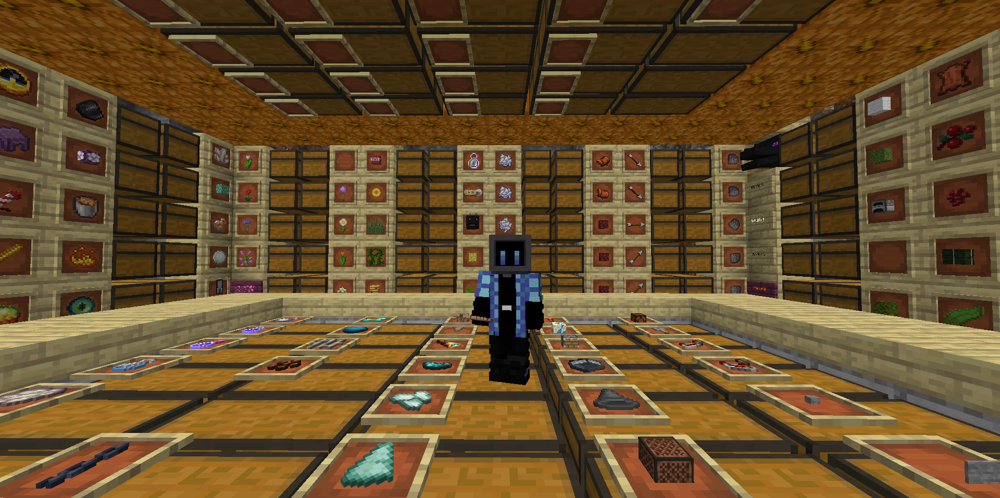

<div align="center">
<h2>ZMBot</h2>
一个可以帮你完成一些简单重复劳动的Minecraft机器人
</div>

## 简介
基于[mineflayer](https://github.com/PrismarineJS/mineflayer)开发的node.js第三方客户端机器人，支持Minecraft 1.17.1及以下版本。它可以帮你完成一些简单重复劳动，比如物品分类、种田砍树、物品交易。目前仍有大量功能在开发中。

寻路使用的是[mineflayer-pathfinder](https://github.com/PrismarineJS/mineflayer-pathfinder)插件，对其中一些特性进行了修改。



## 已实现特性
- 记录路径并回放
- 装配武器和盔甲
- 打开指定的储物箱
- 自动进食和睡觉
- 对物品进行分类

## 启动
```
node main.js [<host>] [<port>] [<name>] [<password>]
```

## 指令
在Minecraft客户端中发送消息，ZMBot会识别并执行相应动作

### 信息相关
- `info` 显示机器人状态，包括生命值、饥饿值、当前位置
- `food` 显示机器人饥饿值、饱食度
- `health` 显示机器人生命值
- `position` 显示机器人当前位置
- `block x y z` 控制台输出坐标为(x,y,z)方块的信息
- `block name|id` 控制台输出指定方块的信息
- `item name|id` 控制台输出指定物品的信息

### 食物相关
- `eat` 立刻进食，同时会消除没有食物标记
- `eat on` 启用自动进食
- `eat off` 禁用自动进食
- `eat set food1,food2` 设置食物为food1和food2
- `eat get` 显示可用食物

### 睡眠相关
- `sleep` 立刻睡觉
- `sleep on` 启动自动睡觉
- `sleep off` 禁用自动睡觉
- `sleep bed x y z` 设置床的坐标为(x,y,z)

### 物品栏相关
- `invt` 显示物品栏内的所有物品
- `invt toss [name]` 扔出指定名称或手中的物品
- `invt equip name [dst]` 装备指定物品到指定位置或手中
- `invt unequip [dst]` 卸载指定位置或手中的装备

### 运动相关
- `come` 使ZMBot前往玩家的位置
- `follow` 使ZMBot跟随玩家

### 储物相关
储物箱可以是箱子、潜影盒、末影箱
- `storage [tag]` 显示指定tag或默认储物箱
- `storage set x y z [tag]` 设置指定tag或默认储物箱位置
- `storage load [tag]` 将指定tag或默认储物箱中的物品放入物品栏
- `storage dump [tag]` 将物品栏中的物品放入指定tag或默认储物箱

### 物品整理相关
- `store scanAll` 使用名为store的路径点扫描所有箱子记录物品类型
- `store scanHere` 在当前位置扫描箱子记录物品类型
- `store rearrange` 将物品栏中的物品进行分类
- `store types` 输出已知物品类型
- `store clear` 清除所有记录的物品类型
- `store path` 输出整理箱子所用的路径点
- `store sub similarName similarId` 设置相似物品名similarName使用similarId进行分类
- `store set name x y z` 将名为name的物品储存在坐标为(x,y,z)的箱子中
- `store del name` 删除名为name物品类型记录
- `store del x y z` 删除坐标为(x,y,z)的箱子记录
- `store locate name` 获取名为name物品的储存位置
- `store mask x y z` 屏蔽坐标为(x,y,z)的箱子

### 路径点相关
- `waypoint` 显示所有路径点标签
- `waypoint record [tag]` 开始记录玩家走过的路径为tag或默认路径点
- `waypoint stop` 停止记录并保存
- `waypoint add` 添加玩家当前位置到当前路径点
- `waypoint save [tag]` 保存当前路径点到tag或默认路径点
- `waypoint clear` 清除当前路径点

## 开发

欢迎提交PR完善机器人功能:)